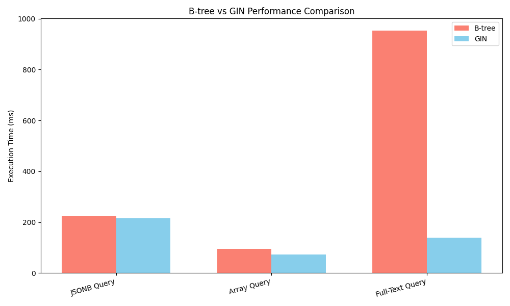

# PostgreSQL B-tree vs. GIN Index Performance Comparison

This project demonstrates the performance difference between B-tree and GIN indexes in PostgreSQL for JSONB, Array, and Full-Text Search queries.

## How to Run

1.  **Set up the environment:**
    *   Make sure you have Python 3 and PostgreSQL installed.
    *   Create a PostgreSQL database named `test`.
    *   Create a virtual environment: `python3 -m venv venv`
    *   Activate it: `source venv/bin/activate`
    *   Install dependencies: `pip install -r requirements.txt` (Note: A `requirements.txt` will be created).

2.  **Run the main script to generate data and metrics:**
    ```bash
    python main.py
    ```
    This will populate the database, run benchmarks, and create a `metrics.json` file.

3.  **Plot the results from the metrics file:**
    ```bash
    python plotter.py
    ```
    This will read `metrics.json` and generate a chart named `index_comparison_from_json.png`.

## Performance Results

The following chart shows the execution time for different query types using B-tree and GIN indexes.


